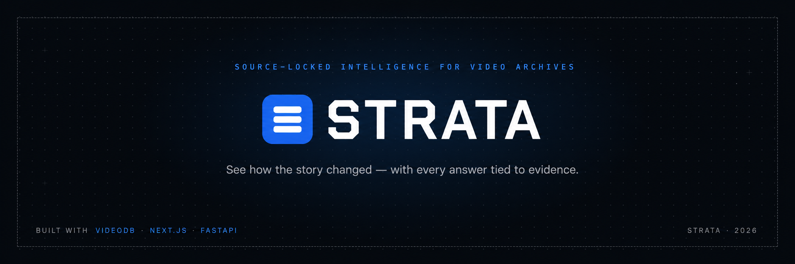
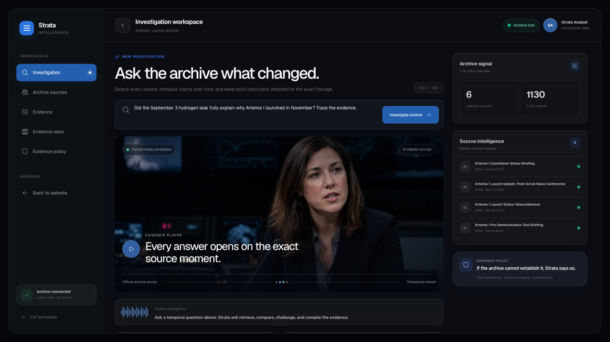
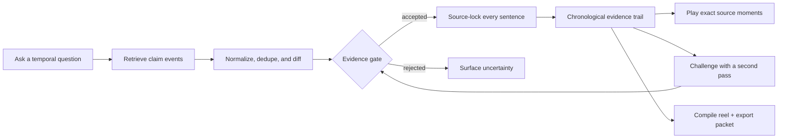
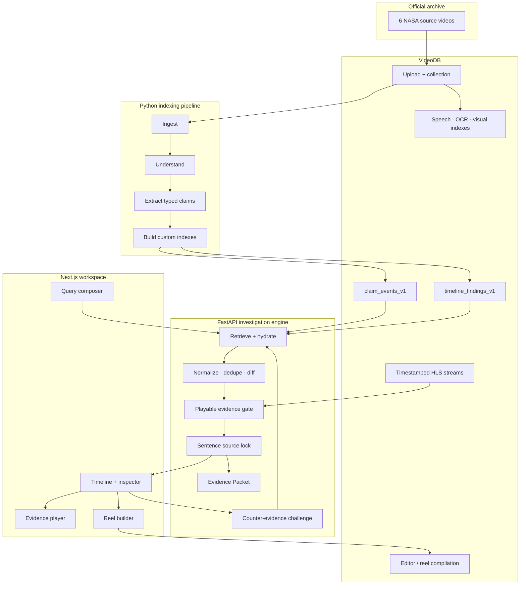

<div align="center">



&nbsp;

[](https://strata-amber-one.vercel.app)
[](https://strata-api-eight.vercel.app/api/health)
[](#verification)
[](#proof--what-is-live)
[](frontend)
[](https://videodb.io)

### Ask the archive what changed—and open every answer on the exact source moment.

Strata is a source-locked investigation workspace for archived video. It searches across hours of footage, reconstructs how a claim or explanation changed over time, challenges its own first conclusion, and compiles the accepted moments into a playable evidence reel. Every factual sentence remains attached to the video, speaker, transcript, date, and timestamps that support it.

**[Watch the demo ↗](https://www.youtube.com/watch?v=P3bLK-vaF7s)** &nbsp;·&nbsp;
**[Explore Strata ↗](https://strata-amber-one.vercel.app)** &nbsp;·&nbsp;
**[Open the investigation workspace ↗](https://strata-amber-one.vercel.app/investigate)** &nbsp;·&nbsp;
**[Inspect the API ↗](https://strata-api-eight.vercel.app/docs)** &nbsp;·&nbsp;
**[Run it locally ↗](#run-it-locally)**

</div>

---

## The story

An important explanation rarely lives in one clean clip.

It starts in a briefing, changes in a press conference, gets narrowed in a later update, and may be overtaken by an entirely different event. By the time someone asks, “Why did this happen?”, the answer is scattered across hours of footage and several dates.

Ordinary video search can find a mention. A transcript search can find a phrase. A general-purpose AI can produce a polished summary. None of those, by themselves, reliably show **how the story changed** while keeping every conclusion tied to the exact footage that establishes it.

Strata was built around a stricter question:

> Can an AI investigate a video archive without asking the user to trust an uncited summary?

The answer is a workflow, not a chat box. Strata retrieves typed claim events, orders them chronologically, compares what changed, rejects conclusions that fail an evidence gate, and source-locks each accepted sentence. A separate challenge pass searches unused footage for counter-evidence. The final timeline can be inspected moment by moment, played from the original source, compiled into a reel, and exported as a machine-readable Evidence Packet.

The current archive follows NASA's 2022 Artemis I launch campaign: six official videos covering the September scrub, repair and testing decisions, Hurricane Ian rollback, and the path to the November launch.

> Source footage is courtesy of NASA. NASA does not endorse this project.

---

## Demo

### Three-minute walkthrough

https://github.com/user-attachments/assets/778dedf7-2aad-4319-b051-e24045c79b5b

**Public fallback — no GitHub sign-in required:** https://www.youtube.com/watch?v=P3bLK-vaF7s



Try the seeded investigation:

> **Did the September 3 hydrogen leak fully explain why Artemis I launched in November? Trace the evidence.**

That question demonstrates the complete product loop:

1. **Ask the archive** — search across all six indexed source videos.
2. **Inspect the diff** — review the chronological claim trail and open the exact source window behind a finding.
3. **Challenge the conclusion** — run a second, archive-wide retrieval pass that prefers previously unused footage.
4. **Compile the evidence** — turn accepted moments into a chronological, playable VideoDB reel.
5. **Export the packet** — download the query, findings, citations, challenge audit, shots, and reel metadata as JSON.

### Judge snapshot

- **Real archive:** six official NASA videos, 16,904 seconds of footage, and 1,130 extracted claim events.
- **Agentic loop:** retrieve, compare, source-lock, challenge with unused footage, and compile a playable reel.
- **Measured result:** 94.4% relevant-event recall versus 83.3% for the naive baseline, with zero unsupported claims in both adjudicated arms.
- **Verified delivery:** 212 backend tests, a passing Next.js production build, and 7/7 submission-readiness checks.

| Live surface | URL |
| --- | --- |
| Landing page | [strata-amber-one.vercel.app](https://strata-amber-one.vercel.app) |
| Investigation workspace | [strata-amber-one.vercel.app/investigate](https://strata-amber-one.vercel.app/investigate) |
| Archive sources | [strata-amber-one.vercel.app/investigate/sources](https://strata-amber-one.vercel.app/investigate/sources) |
| Evidence view | [strata-amber-one.vercel.app/investigate/evidence](https://strata-amber-one.vercel.app/investigate/evidence) |
| Evidence reels | [strata-amber-one.vercel.app/investigate/reels](https://strata-amber-one.vercel.app/investigate/reels) |
| Evidence policy | [strata-amber-one.vercel.app/investigate/policy](https://strata-amber-one.vercel.app/investigate/policy) |
| FastAPI docs | [strata-api-eight.vercel.app/docs](https://strata-api-eight.vercel.app/docs) |
| API health | [strata-api-eight.vercel.app/api/health](https://strata-api-eight.vercel.app/api/health) |

---

## Proof — what is live

This repository does not substitute canned investigation responses when live data fails.

- **The application is deployed.** The Next.js frontend and FastAPI backend are live as separate Vercel projects.
- **The archive is real.** Six official NASA videos are stored in one VideoDB collection with six distinct VideoDB IDs.
- **The media is indexed.** All six sources have spoken-word, OCR, and visual-context artifacts plus retrieval indexes.
- **The clips are playable.** Accepted evidence is hydrated into exact timestamped HLS source streams.
- **The reel is generated.** VideoDB's editor compiles selected source windows into a chronological playable stream.
- **The challenge is a second pass.** It runs new counter-queries, boosts unused videos, and applies the same evidence gate as the first answer.
- **The evaluation is frozen and adjudicated.** Twelve questions compare a naive all-transcripts prompt with Strata's indexed retrieval, diff, gate, and source-lock pipeline.
- **The repository is verified.** `212` backend tests pass, the frontend lints and builds, and all `7/7` submission-readiness checks pass.

Run the readiness gate yourself:

```bash
./.venv/bin/python -m pipeline.verify
```

Expected result:

```text
[PASS] VideoDB credential configured
[PASS] six-source manifest
[PASS] all videos indexed
[PASS] Phase 1 windows pinned
[PASS] 12 frozen evaluation cases
[PASS] two-arm real evaluation
[PASS] repository README

7/7 readiness checks passed
```

---

## Table of contents

- [The problem](#the-problem)
- [What Strata built](#what-strata-built)
- [Product workflow](#product-workflow)
- [Architecture](#architecture)
- [How source locking works](#how-source-locking-works)
- [How VideoDB is used](#how-videodb-is-used)
- [Evaluation](#evaluation)
- [What's real and what is limited](#whats-real-and-what-is-limited)
- [Tech stack](#tech-stack)
- [API](#api)
- [Project structure](#project-structure)
- [Run it locally](#run-it-locally)
- [Build the archive](#build-the-archive)
- [Verification](#verification)
- [Deployment](#deployment)
- [Evidence policy](#evidence-policy)

---

## The problem

Video archives preserve the record, but they are difficult to investigate.

The problem is not only finding a keyword. A useful investigation must answer several harder questions:

- When did a claim first appear?
- Did a later source repeat, qualify, correct, or replace it?
- Which exact footage supports each sentence in the conclusion?
- Is the cited moment playable, or is it only a transcript fragment?
- Did the system search for evidence that weakens its own first answer?
- What remains unproven by the archive?

A normal semantic search result is a ranked list of moments. It does not automatically produce a chronological account. A normal generated answer may combine several moments into a sentence whose wording is stronger than any individual source. And a citation added after generation does not prove that every factual clause is actually supported.

For journalism, research, legal review, public records, and intelligence work, “the model probably found it somewhere” is not an acceptable evidence policy.

Strata treats retrieval, chronology, playable media, uncertainty, and provenance as one system.

---

## What Strata built

Strata turns a video collection into an investigation workspace with five connected capabilities.

### 1. Archive-wide natural-language investigation

Users ask temporal and causal questions without knowing which source contains the answer. Strata expands archive-specific language, searches custom VideoDB indexes, merges duplicate hits, and rebuilds typed claim events from the indexed metadata.

### 2. Deterministic chronological comparison

Retrieved events are normalized and compared with deterministic rules. The engine labels meaningful transitions such as new information, confirmation, correction, status change, escalation, and supersession. Chronology is based on source dates and exact media windows—not the order in which search happened to return results.

### 3. Sentence-level source locking

The summary is split into factual sentences. Each sentence must name the event IDs that support it, and those events must survive the evidence gate. Unsupported wording is withheld or converted into an explicit “not established by this archive” state.

### 4. Independent challenge pass

“Challenge this conclusion” does not simply ask the same model to reconsider its prose. Strata generates counter-queries, searches the archive again, boosts footage from sources unused by the initial answer, records rejected candidates, and reports whether the new evidence confirms, qualifies, or changes the conclusion.

### 5. Playable evidence and export

Accepted events are hydrated into source clips with context padding. Users can inspect the transcript and metadata, play the exact moment, choose events for a chronological reel, and download an Evidence Packet containing the complete audit trail.

---

## Product workflow



### Ask the archive

The query composer sends the question and archive ID to the FastAPI investigation engine. The interface reports real searching, comparing, source-locking, and completion states; it does not silently fall back to a sample response.

### Inspect the diff

The completed workspace presents:

- the source-locked conclusion;
- a chronological event trail;
- exact timestamps and transcript excerpts;
- source video, speaker, date, status, certainty, and normalized fields;
- sentence-to-event mappings;
- accepted and rejected evidence;
- playable HLS media.

### Challenge and compile

The challenge audit exposes what the second pass searched, which candidates were rejected, whether new videos were accepted, and which conclusion sentences were affected. The reel builder then compiles only the selected accepted events.

---

## Architecture

Strata is split into three independently testable layers: a media/indexing pipeline, a source-locked investigation API, and a dark investigation workspace.



### Layer responsibilities

| Layer | Responsibility |
| --- | --- |
| `pipeline/` | Ingest videos, create understanding artifacts, extract typed claim events, materialize custom indexes, run evaluation, and enforce readiness. |
| `services/api/` | Search, hydrate, normalize, compare, gate, source-lock, challenge, compile reels, and serialize Evidence Packets. |
| `frontend/` | Render the landing page and fixed-sidebar investigation workspace with archive status, timeline inspection, HLS playback, challenge audit, and reel controls. |
| `data/` | Version the source manifest, extracted events, evaluation cases, adjudication worksheet, and final results. |

### Runtime investigation loop

```text
VideoDB semantic search
→ runtime hydration into typed claim events
→ cross-query deduplication
→ deterministic chronological diff
→ playable-shot hydration
→ evidence gate
→ sentence-level source lock
→ investigation response
```

The challenge route repeats archive-wide retrieval with counter-queries, prefers unused source videos, applies the same playback and evidence gates, and preserves the first-pass audit.

---

## How source locking works

Source locking is the main reliability boundary.

### Typed evidence

Every accepted event carries structured fields such as:

- `event_id`;
- `video_id`;
- source date;
- start and end timestamps;
- speaker;
- claim type;
- claim status;
- certainty;
- normalized value;
- transcript evidence;
- playable stream reference.

### Evidence gate

A proposed finding is accepted only when its supporting events exist and playable evidence shots can be hydrated. Rejection reasons remain visible for the challenge audit and evaluation.

### Sentence map

Generated conclusion text is split sentence by sentence. Each supported sentence lists `supported_by_event_ids`. The frontend uses those IDs to highlight the corresponding timeline events and open the relevant source moment.

### Honest uncertainty

If retrieval does not cover the query-specific terms, or a finding cannot survive the gate, Strata returns an `insufficient_evidence` state. It does not fill the gap with outside knowledge or invented timestamps.

This produces a simple product rule:

> **If the archive cannot establish it, Strata says so.**

---

## How VideoDB is used

VideoDB is not only a storage layer in Strata; it supplies the media-native operations behind the investigation.

| VideoDB capability | How Strata uses it |
| --- | --- |
| Collections and URL upload | Build one versioned archive from six official videos. |
| Spoken-word indexing | Retrieve transcript evidence across long briefings. |
| OCR indexing | Preserve relevant on-screen text as searchable context. |
| Visual understanding | Add visual-context artifacts where speech alone is insufficient. |
| Custom temporal indexes | Store `claim_events_v1` and `timeline_findings_v1` records with exact windows and typed metadata. |
| Semantic search | Retrieve evidence for the initial question and counter-queries. |
| Structured query and counts | Report archive health, index state, source coverage, and claim totals. |
| Timestamped streams | Play the exact accepted source window with context padding. |
| Sandbox text generation | Extract claims into strict JSON structures. |
| Editor timeline | Compile selected evidence shots into a chronological reel. |

All VideoDB access passes through [`services/api/adapters/videodb_client.py`](services/api/adapters/videodb_client.py). The API key stays server-side and never enters the archive manifest or frontend bundle.

---

## Evaluation

Strata includes a frozen, two-arm comparative evaluation rather than relying only on a hand-picked demo question.

### Method

- **Dataset:** 12 frozen questions in [`data/evaluation_cases.json`](data/evaluation_cases.json).
- **Archive:** the same six-video manifest revision for both arms.
- **Naive arm:** all six transcripts concatenated chronologically into one locked prompt.
- **Strata arm:** VideoDB indexes, typed retrieval, deterministic diff, playable evidence gate, and sentence source lock.
- **Model configuration:** VideoDB `pro`, temperature `0.0`, and a 600-token answer limit for both arms.
- **Scoring:** relevant-event recall from overlapping gold windows and unsupported-claim rate from manually adjudicated atomic propositions.

### Results

| System | Relevant-event retrieval recall ↑ | Unsupported-claim rate ↓ |
| --- | ---: | ---: |
| Naive: all transcripts → one prompt | 15 / 18 (**83.3%**) | 0 / 63 (**0.0%**) |
| Strata: indexed retrieval + diff + source lock | 17 / 18 (**94.4%**) | 0 / 32 (**0.0%**) |

Strata recovered two additional gold evidence windows—an **11.1 percentage-point increase in relevant-event recall**—while preserving a zero unsupported-claim rate in the adjudicated run.

These figures are generated from the committed frozen cases and [`data/evaluation_results.json`](data/evaluation_results.json); they are not estimates.

Reproduce the published score:

```bash
./.venv/bin/python -m pipeline.evaluate data/evaluation_results.json
```

Run both live arms and create a fresh human-review worksheet:

```bash
./.venv/bin/python -m pipeline.run_evaluation
```

Every atomic proposition in `data/evaluation_worksheet.json` must then be checked against its cited footage. The finalizer refuses to publish results while any `supported` value remains `null`:

```bash
./.venv/bin/python -m pipeline.finalize_evaluation
./.venv/bin/python -m pipeline.evaluate data/evaluation_results.json
```

---

## What's real and what is limited

| Capability | Current implementation |
| --- | --- |
| Archive | Six real, official NASA Artemis I videos in one live VideoDB collection. |
| Retrieval | Live VideoDB semantic search over custom temporal indexes. |
| Evidence playback | Exact timestamped HLS source streams returned by VideoDB. |
| Chronological comparison | Deterministic normalization, deduplication, and diff rules in the API. |
| Conclusion citations | Sentence-level mapping to accepted event IDs. |
| Challenge | A separate archive-wide counter-query pass with source novelty checks. |
| Evidence reel | Live VideoDB editor compilation from selected accepted windows. |
| Evidence Packet | Downloadable JSON generated from the investigation state. |
| Failure behavior | Missing credentials, unavailable media, and insufficient evidence are surfaced explicitly; no canned result is substituted. |
| Archive scope | The MVP searches the six-video Artemis I archive, not the open web. |
| Truth judgments | Strata compares recorded claims; it does not infer intent or label a speaker truthful or deceptive. |
| Investigation persistence | Investigation state is currently process-local. Durable shared persistence is the next production-hardening step for serverless cold starts. |

---

## Tech stack

| Area | Technology |
| --- | --- |
| Web | Next.js 16.2, React 19, TypeScript 5 |
| Styling | Tailwind CSS 4, custom dark design system |
| Interface | HugeIcons, HLS.js |
| API | FastAPI, Pydantic 2, Uvicorn |
| Media intelligence | VideoDB Python SDK |
| Pipeline | Python 3.11+, strict JSON artifacts |
| Testing | Pytest, ESLint, Next.js production build |
| Hosting | Vercel frontend and FastAPI projects |

---

## API

The public API is documented interactively at [strata-api-eight.vercel.app/docs](https://strata-api-eight.vercel.app/docs).

### Routes

```text
GET  /api/health
GET  /api/archive
POST /api/investigations
GET  /api/investigations/{investigation_id}
POST /api/investigations/{investigation_id}/challenge
POST /api/investigations/{investigation_id}/reel
GET  /api/investigations/{investigation_id}/packet
```

### Create an investigation

```bash
curl -X POST "https://strata-api-eight.vercel.app/api/investigations" \
  -H "Content-Type: application/json" \
  -d '{
    "archive_id": "artemis-i-2022",
    "query": "Did the September 3 hydrogen leak fully explain why Artemis I launched in November? Trace the evidence."
  }'
```

The response contains the investigation state, chronological events, accepted findings, source-locked summary sentences, playable evidence shots, relation graph, challenge state, and reel state.

### Challenge a conclusion

```bash
curl -X POST \
  "https://strata-api-eight.vercel.app/api/investigations/INVESTIGATION_ID/challenge" \
  -H "Content-Type: application/json" \
  -d '{"instruction": "Challenge this conclusion"}'
```

### Generate a reel

```bash
curl -X POST \
  "https://strata-api-eight.vercel.app/api/investigations/INVESTIGATION_ID/reel" \
  -H "Content-Type: application/json" \
  -d '{"event_ids": ["EVENT_ID"]}'
```

Request and response contracts are strict Pydantic models under [`services/api/schemas/`](services/api/schemas).

---

## Project structure

```text
Strata/
├── frontend/                         # Next.js 16 application
│   ├── app/
│   │   ├── page.tsx                  # landing page
│   │   └── investigate/              # dashboard and sub-pages
│   │       ├── page.tsx
│   │       ├── sources/
│   │       ├── evidence/
│   │       ├── reels/
│   │       └── policy/
│   ├── components/                   # workspace, timeline, player, challenge, reel
│   ├── lib/                          # API client, types, formatting
│   └── public/strata/                # optimized product imagery
├── services/api/
│   ├── adapters/                     # VideoDB adapter and payload normalization
│   ├── comparison/                   # normalize, dedupe, diff, gate, source lock
│   ├── retrieval/                    # hydration, counter-queries, shots, challenge filter
│   ├── routes/                       # health, archive, investigation endpoints
│   ├── schemas/                      # strict public API contracts
│   ├── investigation_engine.py       # end-to-end orchestration
│   └── main.py                       # FastAPI application and CORS
├── pipeline/
│   ├── ingest.py                     # upload and manifest persistence
│   ├── understand.py                 # speech, OCR, and visual artifacts
│   ├── extract_claims.py             # strict typed event extraction
│   ├── build_index.py                # custom temporal indexes
│   ├── run_evaluation.py             # live two-arm evaluation
│   ├── finalize_evaluation.py        # adjudication completeness gate
│   └── verify.py                     # seven-point readiness gate
├── data/
│   ├── archive_manifest.json         # six-source manifest and verified windows
│   ├── claim_events.json             # extracted typed evidence
│   ├── evaluation_cases.json         # 12 frozen questions
│   └── evaluation_results.json       # adjudicated two-arm results
├── tests/                            # 212 backend tests
├── assets/                           # README production screenshots
├── requirements.txt
└── README.md
```

---

## Run it locally

### Prerequisites

- Python 3.11 or newer
- Node.js compatible with Next.js 16
- npm
- A VideoDB API key

### 1. Clone the repository

```bash
git clone https://github.com/Enoch208/Strata.git
cd Strata
```

### 2. Create the Python environment

```bash
python3 -m venv .venv
./.venv/bin/pip install -r requirements.txt
```

### 3. Configure the backend

```bash
cp .env.example .env.local
```

Add your VideoDB credential:

```dotenv
# Required for live archive operations. Server-side only.
VIDEODB_API_KEY=

# Optional. The persisted collection ID is normally read from the manifest.
VIDEODB_COLLECTION_ID=

# Extraction configuration.
STRATA_EXTRACTION_MODEL=pro
STRATA_EXTRACTION_TEMPERATURE=0
STRATA_CLIP_PADDING_SECONDS=2

# Optional comma-separated frontend origins.
STRATA_ALLOWED_ORIGINS=http://localhost:3000,http://127.0.0.1:3000
```

Process-level variables take precedence over `.env.local`, which takes precedence over `.env`. Never expose `VIDEODB_API_KEY` through a `NEXT_PUBLIC_*` variable.

### 4. Install the frontend

```bash
cd frontend
npm install
cd ..
```

### 5. Start both services

Terminal one:

```bash
./.venv/bin/uvicorn services.api.main:app --reload --port 8000
```

Terminal two:

```bash
cd frontend
npm run dev
```

Open [http://localhost:3000](http://localhost:3000).

The frontend defaults to `http://127.0.0.1:8000`. To use another API:

```dotenv
# frontend/.env.local
NEXT_PUBLIC_API_BASE_URL=http://127.0.0.1:8000
```

---

## Build the archive

The Phase 1 path proves the two critical sources before processing the full six-video collection:

```bash
./.venv/bin/python -m pipeline.ingest --phase1
./.venv/bin/python -m pipeline.understand --phase1
./.venv/bin/python -m pipeline.extract_claims --phase1
./.venv/bin/python -m pipeline.build_index
```

The pinned windows are:

- **3 September:** `01:26–01:41` — liquid-hydrogen leak and launch scrub.
- **30 September:** `01:55–02:19` — Hurricane Ian forecast and rollback.

Confirm that the windows belong to different VideoDB `video_id` values, then run the same pipeline without `--phase1` for all six videos.

The understand stage can fall back to bounded, timestamped records from the real VideoDB transcript when an analyzer produces oversized speech scenes that cannot be embedded. Pipeline stages fail visibly on missing credentials or media errors and do not write invented substitutes.

---

## Verification

The verified repository state is:

- `212` backend tests passing;
- frontend ESLint passing;
- Next.js production build passing across all seven routes;
- `7/7` readiness checks passing;
- two-arm evaluation score reproducible from committed adjudications.

Run everything:

```bash
# Backend tests
./.venv/bin/python -m pytest -q

# Python import/bytecode verification
./.venv/bin/python -m compileall -q services pipeline tests

# Submission-readiness gate
./.venv/bin/python -m pipeline.verify

# Published evaluation
./.venv/bin/python -m pipeline.evaluate data/evaluation_results.json

# Frontend
cd frontend
npm run lint
npm run build
```

The tests cover payload normalization, extraction, index materialization, hydration, deduplication, deterministic comparison, evidence gating, source locking, honest uncertainty, summary citations, challenge source novelty, chronological reel generation, API routes, evaluation rules, and readiness enforcement.

---

## Deployment

The production system uses two Vercel projects:

| Project | Responsibility | Production URL |
| --- | --- | --- |
| `strata` | Next.js frontend | [strata-amber-one.vercel.app](https://strata-amber-one.vercel.app) |
| `strata-api` | FastAPI investigation service | [strata-api-eight.vercel.app](https://strata-api-eight.vercel.app) |

Production and preview environments use:

```text
# Backend
VIDEODB_API_KEY
VIDEODB_COLLECTION_ID
STRATA_ALLOWED_ORIGINS

# Frontend
NEXT_PUBLIC_API_BASE_URL
```

The production API is configured for the frontend's exact origin. Secrets are stored only in Vercel's server-side environment and are not committed to the repository.

---

## Evidence policy

Strata is intentionally conservative:

1. **No accepted finding without a timestamped archive event.**
2. **No supported sentence without explicit event IDs.**
3. **No evidence event without a playable source shot.**
4. **No challenge qualification without a separate retrieval pass.**
5. **No invented fallback when credentials, indexes, or media are unavailable.**
6. **No claim about intent, deception, or truthfulness beyond what the archive establishes.**

The product is designed to answer:

> What does this archive establish, how did it change, and where can I watch the evidence?

Not:

> What should I believe without checking the source?

---

## Acknowledgements

- [VideoDB](https://videodb.io) for media ingestion, indexing, search, timestamped playback, and reel compilation.
- [NASA](https://www.nasa.gov) for the official Artemis I source footage used in the MVP archive.
- [Vercel](https://vercel.com) for hosting the public frontend and API.

<div align="center">

**The archive is the source of truth. Strata makes the trail inspectable.**

[Launch Strata ↗](https://strata-amber-one.vercel.app)

</div>
